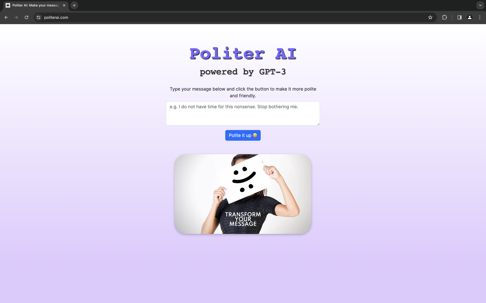

[](https://stand-with-ukraine.pp.ua)

# Politer AI - Web application

This is a [Next.js](https://nextjs.org/) project bootstrapped
with [`create-next-app`](https://github.com/vercel/next.js/tree/canary/packages/create-next-app).

**Politer AI** is a web app that uses GPT-3, a powerful AI model, to make messages more polite and friendly.
Type your message and click the button to see the result.
You can use it for any communication that needs politeness and friendliness.
No registration or personal data needed, and it’s free.

## PROJECT SPECIFICATION

• Programming language: [TypeScript](https://www.typescriptlang.org);

• SDK: [Next.js](https://nextjs.org);

• Version control system: [Git](https://git-scm.com);

• Git Hosting Service: [GitHub](https://github.com);

• CI/CD: [Vercel](https://vercel.com/features/previews) is used to
deliver the new releases to the production environment after every push to the **master** branch;

• Api: https://platform.openai.com/docs/api-reference;

• Architectural pattern:
[Monolith](https://learn.microsoft.com/en-us/dotnet/architecture/modern-web-apps-azure/common-web-application-architectures#all-in-one-applications);

• Screenshot:

<!--suppress CheckImageSize -->


## Getting Started

To run this project locally, you must have Node.js on your machine.
First, run the development server:

```bash
npm run dev
```

Open [http://localhost:3000](http://localhost:3000) with your browser to see the result.

[API routes](https://nextjs.org/docs/api-routes/introduction) can be accessed
on [http://localhost:3000/api/polite](http://localhost:3000/api/polite).

The `pages/api` directory is mapped to `/api/*`. Files in this directory are treated
as [API routes](https://nextjs.org/docs/api-routes/introduction) instead of React pages.

This project uses [`next/font`](https://nextjs.org/docs/basic-features/font-optimization) to automatically optimize and
load Inter, a custom Google Font.

• **Code Readability:** code is easily readable with no unnecessary blank lines, no unused variables
or methods, and no commented-out code, all variables, methods, and resource IDs are descriptively
named such that another developer reading the code can easily understand their function.

## Credits

This project is based on
the [Build and Deploy a GPT-3 App in Next.js in 1 Hour (ChatGPT,
TypeScript)](https://youtu.be/5i1Q2GSqidU?si=yJQPo4ToK31t9wEy)
by [Coding in Flow](https://github.com/codinginflow) YouTube channel.
All credit goes to the original author [Florian Walther](https://github.com/florianwalther-private).
I only followed
along and made some minor changes.
